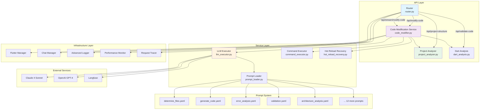
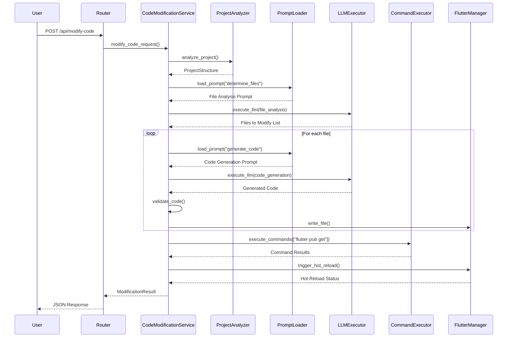
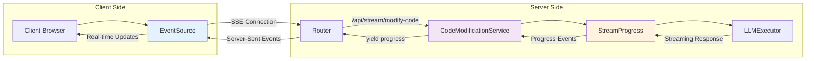
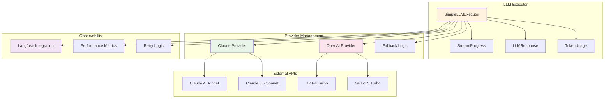
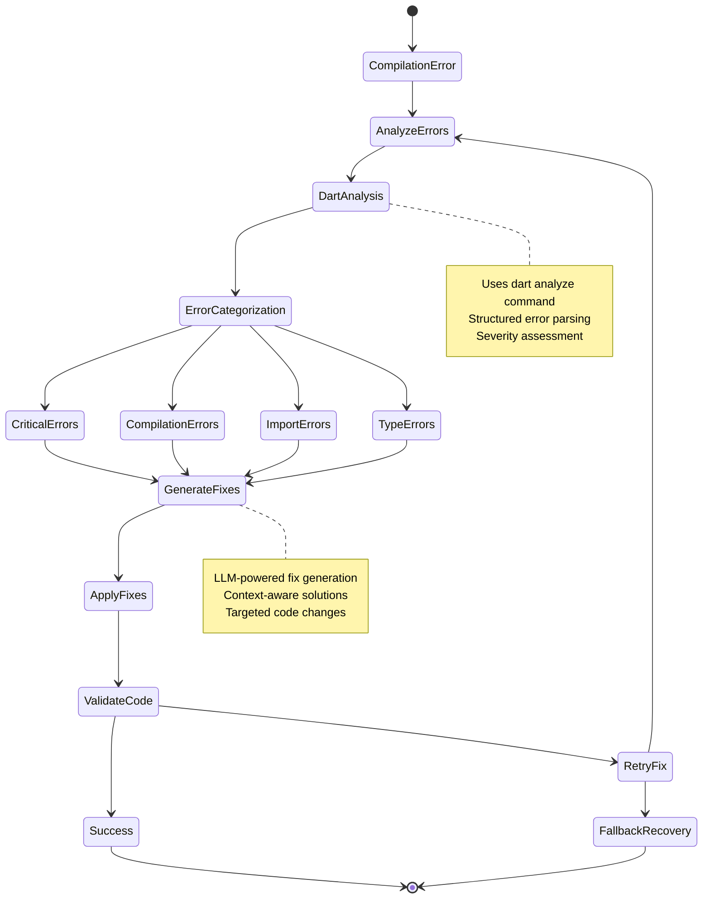
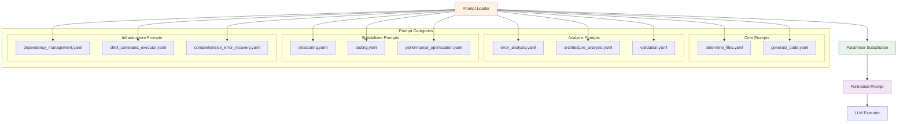
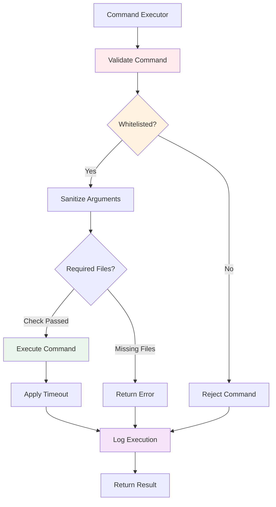
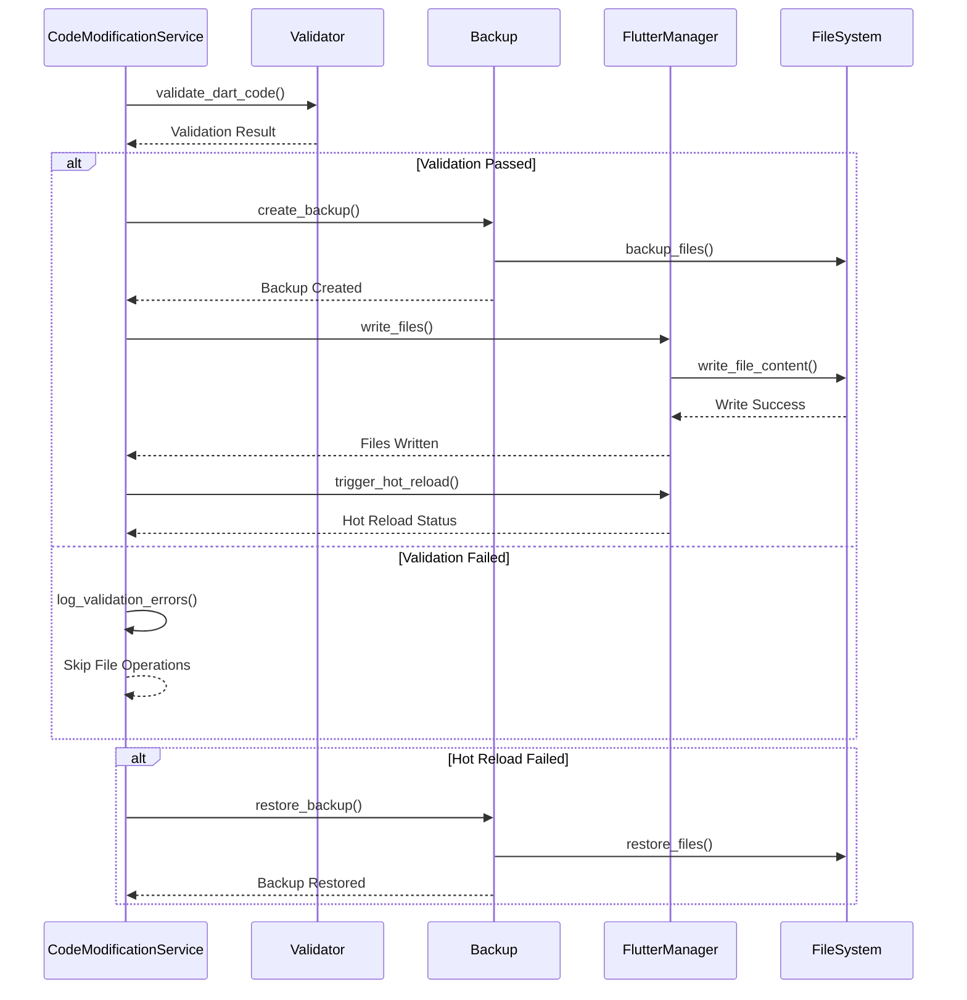
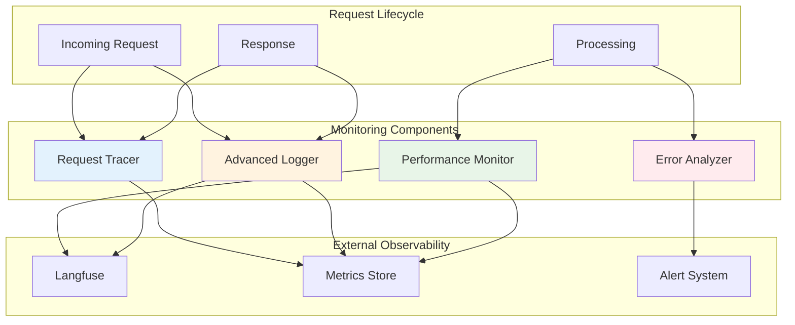

# Code Modification Module - Mermaid Architecture Diagrams

## 1. Overall System Architecture



## 2. Code Modification Workflow



## 3. Streaming Architecture



## 4. LLM Executor Architecture



## 5. Project Analysis Flow

```mermaid
flowchart TD
    PA[Project Analyzer] --> PY[Parse pubspec.yaml]
    PA --> DF[Scan Dart Files]
    PA --> SD[Analyze Structure]
    
    PY --> DEP[Extract Dependencies]
    PY --> META[Project Metadata]
    
    DF --> IMP[Parse Imports]
    DF --> CLS[Extract Classes]
    DF --> WID[Find Widgets]
    
    SD --> ARCH[Detect Architecture]
    SD --> PAT[Identify Patterns]
    
    DEP --> PS[Project Structure]
    META --> PS
    IMP --> PS
    CLS --> PS
    WID --> PS
    ARCH --> PS
    PAT --> PS
    
    PS --> CM[Code Modification Service]

    stylePA fill:#e8f5e8
    style PS fill:#fff3e0
    style CM fill:#f3e5f5
```

## 6. Error Recovery System



## 7. Prompt System Architecture



## 8. Command Execution Security



## 9. File Operation Flow



## 10. Monitoring and Observability

