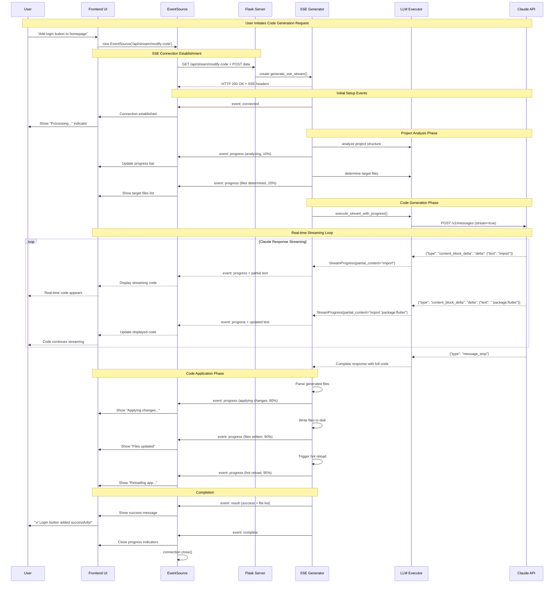
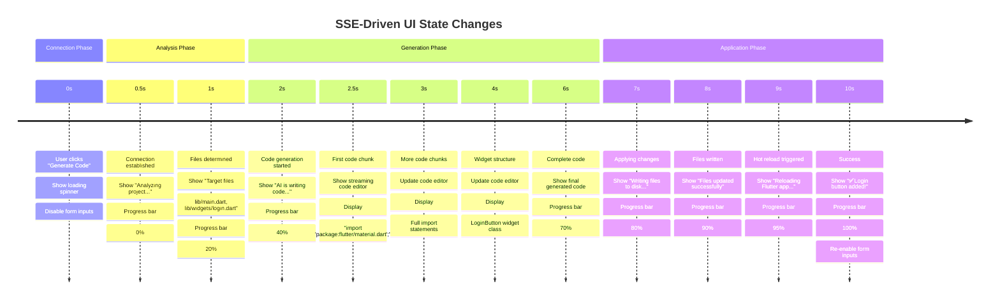
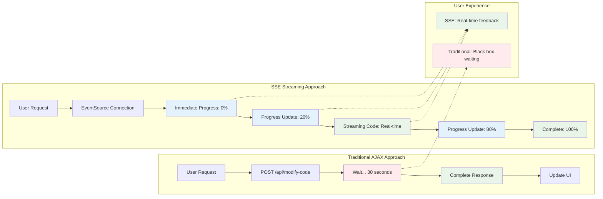
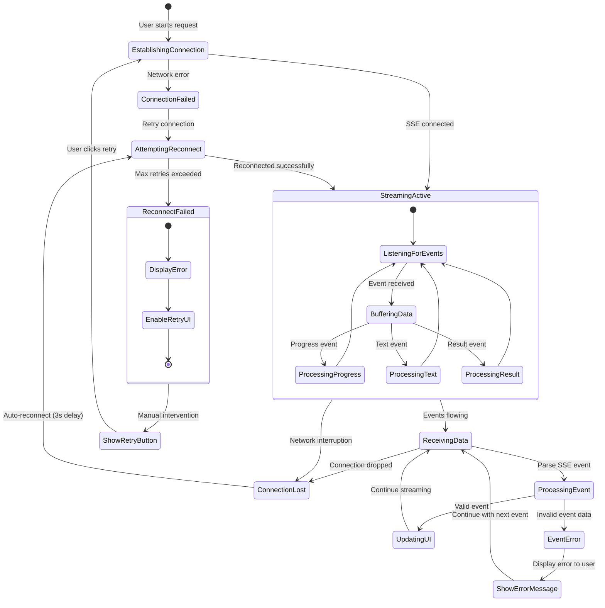

# Claude to Frontend SSE Flow

Detailed technical diagrams showing the complete data flow from Claude API to frontend UI through SSE streaming.

## 1. Complete Request-Response Flow



## 2. SSE Data Transformation Pipeline

```mermaid
flowchart TD
    subgraph "Claude API Layer"
        ClaudeReq[Claude Streaming Request]
        ClaudeChunk[Content Block Delta]
        ClaudeText["{\\"type\\": \\"content_block_delta\\", \\"delta\\": {\\"text\\": \\"code chunk\\"}}"]
    end
    
    subgraph "LLM Executor Layer"
        ParseResp[Parse Claude Response]
        ExtractText[Extract Text Delta]
        CreateProgress[Create StreamProgress Object]
        ProgressObj["StreamProgress(stage='generating', partial_content='code', progress=45%)"]
    end
    
    subgraph "SSE Generator Layer"
        ReceiveProgress[Receive StreamProgress]
        ConvertSSE[Convert to SSE Format]
        SSEEvent["event: progress\\ndata: {\\"stage\\": \\"generating\\", \\"partial_content\\": \\"code\\"}\\n\\n"]
    end
    
    subgraph "Network Transport"
        HTTPStream[HTTP Response Stream]
        ChunkedEncoding[Transfer-Encoding: chunked]
        SSEHeaders["Content-Type: text/event-stream\\nConnection: keep-alive"]
    end
    
    subgraph "Frontend Layer"
        EventSource[EventSource API]
        MessageEvent[MessageEvent Object]
        ParseJSON[JSON.parse(event.data)]
        UIUpdate[Update React/Vue Components]
    end
    
    ClaudeReq --> ClaudeChunk
    ClaudeChunk --> ClaudeText
    ClaudeText --> ParseResp
    
    ParseResp --> ExtractText
    ExtractText --> CreateProgress
    CreateProgress --> ProgressObj
    
    ProgressObj --> ReceiveProgress
    ReceiveProgress --> ConvertSSE
    ConvertSSE --> SSEEvent
    
    SSEEvent --> HTTPStream
    HTTPStream --> ChunkedEncoding
    ChunkedEncoding --> SSEHeaders
    
    SSEHeaders --> EventSource
    EventSource --> MessageEvent
    MessageEvent --> ParseJSON
    ParseJSON --> UIUpdate
    
    style ClaudeText fill:#e8f5e8
    style ProgressObj fill:#e3f2fd
    style SSEEvent fill:#fff3e0
    style UIUpdate fill:#ffebee
```

## 3. Frontend SSE Event Processing

```mermaid
graph TB
    subgraph "EventSource Setup"
        CreateES[new EventSource('/api/stream/modify-code')]
        SetupHandlers[Setup Event Handlers]
        ConnectionOpen[Connection Opened]
    end
    
    subgraph "Event Type Routing"
        ReceiveEvent[Receive SSE Event]
        CheckType{Event Type?}
        
        ProgressHandler[onprogress Handler]
        TextHandler[ontext Handler]
        ResultHandler[onresult Handler]
        CompleteHandler[oncomplete Handler]
        ErrorHandler[onerror Handler]
    end
    
    subgraph "Progress Event Processing"
        ParseProgress[Parse Progress Data]
        UpdateProgressBar[Update Progress Bar]
        UpdateStatus[Update Status Text]
        ShowPartialContent[Show Streaming Code]
    end
    
    subgraph "Text Event Processing"
        ParseTextChunk[Parse Text Chunk]
        AppendToBuffer[Append to Response Buffer]
        UpdateCodeEditor[Update Code Editor]
        ScrollToEnd[Scroll to Latest Content]
    end
    
    subgraph "Result Event Processing"
        ParseResult[Parse Final Result]
        ShowFilesList[Show Modified Files]
        ShowSuccessMsg[Show Success Message]
        UpdateAppPreview[Update App Preview]
    end
    
    subgraph "Error Handling"
        ParseError[Parse Error Data]
        ShowErrorMsg[Show Error Message]
        RetryButton[Show Retry Button]
        LogError[Log to Console]
    end
    
    CreateES --> SetupHandlers
    SetupHandlers --> ConnectionOpen
    ConnectionOpen --> ReceiveEvent
    
    ReceiveEvent --> CheckType
    
    CheckType -->|progress| ProgressHandler
    CheckType -->|text| TextHandler
    CheckType -->|result| ResultHandler
    CheckType -->|complete| CompleteHandler
    CheckType -->|error| ErrorHandler
    
    ProgressHandler --> ParseProgress
    ParseProgress --> UpdateProgressBar
    ParseProgress --> UpdateStatus
    ParseProgress --> ShowPartialContent
    
    TextHandler --> ParseTextChunk
    ParseTextChunk --> AppendToBuffer
    AppendToBuffer --> UpdateCodeEditor
    UpdateCodeEditor --> ScrollToEnd
    
    ResultHandler --> ParseResult
    ParseResult --> ShowFilesList
    ParseResult --> ShowSuccessMsg
    ParseResult --> UpdateAppPreview
    
    ErrorHandler --> ParseError
    ParseError --> ShowErrorMsg
    ParseError --> RetryButton
    ParseError --> LogError
    
    style ReceiveEvent fill:#e3f2fd
    style UpdateCodeEditor fill:#e8f5e8
    style ShowSuccessMsg fill:#e8f5e8
    style ShowErrorMsg fill:#ffebee
```

## 4. Real-time UI Updates



## 5. SSE vs Traditional AJAX Comparison



## 6. Error Recovery and Reconnection



This comprehensive set of diagrams shows exactly how SSE enables real-time streaming from Claude API all the way to the frontend UI, providing users with immediate feedback and a smooth live code generation experience.