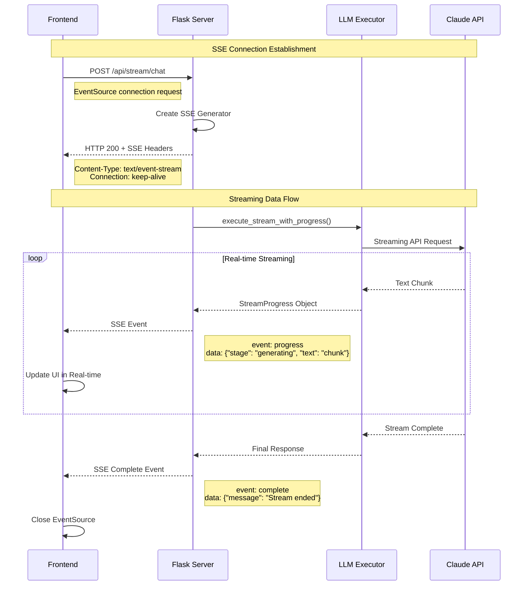
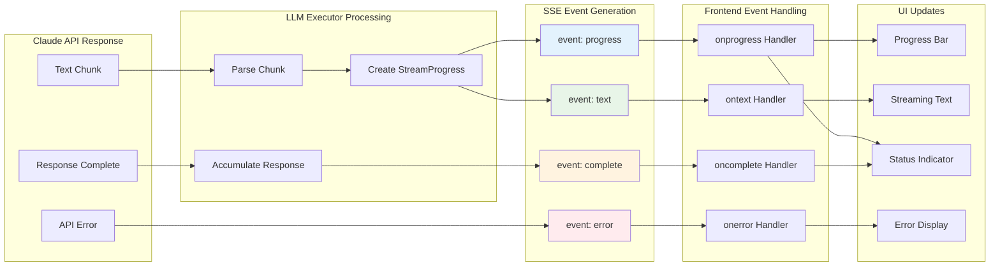
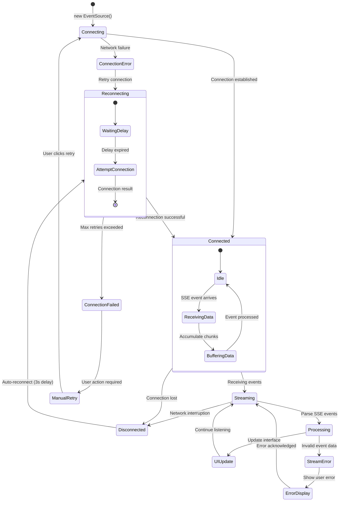
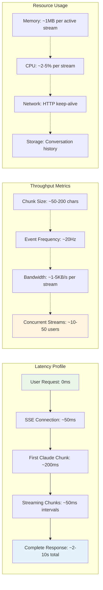

# SSE Streaming Architecture: Claude to Frontend

This document contains high-level diagrams showing how Server-Sent Events (SSE) streaming works from Claude API to the frontend interface.

## 1. SSE Connection Flow



## 2. SSE Protocol Deep Dive

```mermaid
graph TB
    subgraph "Frontend (Browser)"
        ES[EventSource API]
        UI[User Interface]
        Buffer[Response Buffer]
    end
    
    subgraph "Network Layer"
        HTTP[HTTP Connection]
        SSEStream[SSE Stream]
    end
    
    subgraph "Flask Server"
        Route[SSE Route Handler]
        Generator[SSE Generator Function]
        AsyncLoop[Async Event Loop]
    end
    
    subgraph "LLM Integration"
        LLMExec[LLM Executor]
        StreamMgr[Stream Manager]
        ProgressTracker[Progress Tracker]
    end
    
    subgraph "Claude API"
        ClaudeStream[Claude Streaming API]
        Chunks[Response Chunks]
    end
    
    ES -->|new EventSource()| HTTP
    HTTP -->|GET /api/stream/chat| Route
    Route --> Generator
    Generator --> AsyncLoop
    
    AsyncLoop --> LLMExec
    LLMExec --> StreamMgr
    StreamMgr --> ClaudeStream
    
    ClaudeStream --> Chunks
    Chunks -->|Text Delta| ProgressTracker
    ProgressTracker -->|StreamProgress| Generator
    
    Generator -->|yield SSE Event| SSEStream
    SSEStream -->|event: progress<br/>data: JSON| HTTP
    HTTP -->|EventSource.onmessage| ES
    ES --> Buffer
    Buffer --> UI
    
    style SSEStream fill:#e1f5fe
    style Generator fill:#f3e5f5
    style ClaudeStream fill:#e8f5e8
```

## 3. SSE Event Types and Data Flow



## 4. SSE Message Format

```mermaid
graph TB
    subgraph "SSE Event Structure"
        EventType[event: progress]
        DataField[data: JSON payload]
        Separator[Empty line terminator]
    end
    
    subgraph "Progress Event Data"
        Stage[stage: "analyzing/generating/applying"]
        Message[message: "Human readable status"]
        PartialContent[partial_content: "Current text chunk"]
        ProgressPercent[progress_percent: 0-100]
        Metadata[metadata: Additional context]
    end
    
    subgraph "Text Event Data"
        TextChunk[text: "Real-time text chunk"]
        Accumulated[accumulated: "Full response so far"]
    end
    
    subgraph "Complete Event Data"
        FinalMessage[message: "Stream completed"]
        TotalTokens[token_count: Usage statistics]
        ConversationId[conversation_id: Chat context]
    end
    
    EventType --> DataField
    DataField --> Separator
    
    DataField -.->|progress event| Stage
    DataField -.->|progress event| Message
    DataField -.->|progress event| PartialContent
    DataField -.->|progress event| ProgressPercent
    DataField -.->|progress event| Metadata
    
    DataField -.->|text event| TextChunk
    DataField -.->|text event| Accumulated
    
    DataField -.->|complete event| FinalMessage
    DataField -.->|complete event| TotalTokens
    DataField -.->|complete event| ConversationId
```

## 5. Error Handling and Reconnection



## 6. Performance Characteristics



## Summary

The SSE streaming architecture provides:

1. **Real-time Communication**: Unidirectional server-to-client streaming
2. **HTTP-based**: Works with existing web infrastructure
3. **Automatic Reconnection**: Built-in resilience with EventSource API
4. **Efficient Protocol**: Minimal overhead compared to WebSockets
5. **Progress Tracking**: Granular updates during long-running operations
6. **Error Recovery**: Graceful handling of network interruptions

This design is optimal for the live code generation use case where the primary need is streaming AI responses and progress updates from server to client.